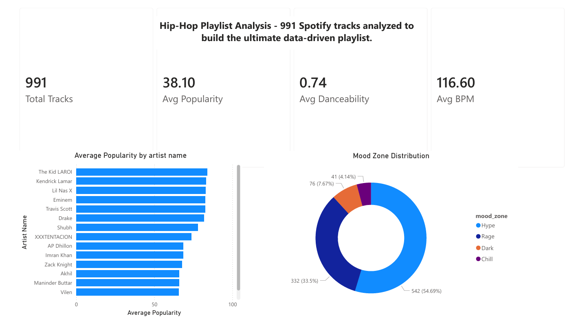
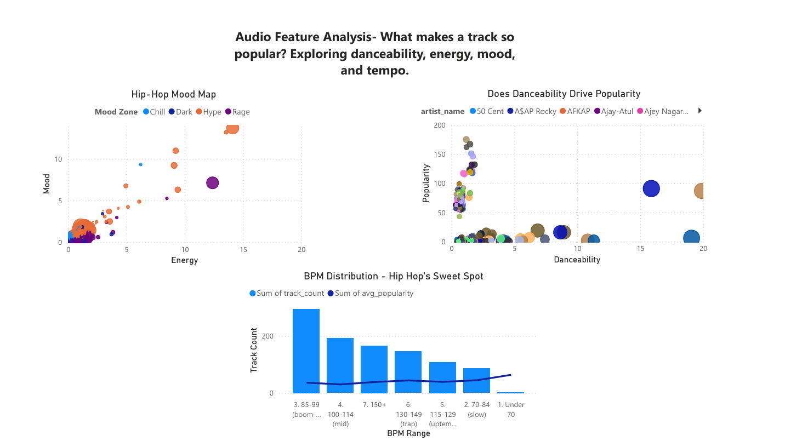
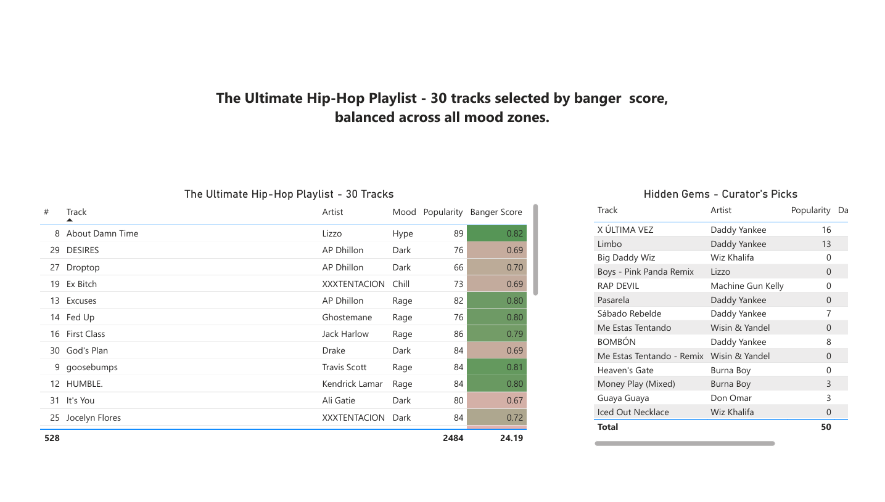

# Hip-Hop Playlist Analysis - Data-Driven Music Curation
A SQL and Power BI project analyzing 991
## Project Overview
**Premise:** You're a data analyst for a streaming platfrm and have been tasked with answering: "What does data say makes the perfect hip-hop playlist?". 
**Tools:** Python • SQL • Power BI • SQLite
**Dataset** Spotify Tracks Dataset (from kaggle) - filtered to specifically hip-hop and rap genres.

---

## Key Findings
- **76% of hip-hop tracks** fall in the "Rage" mood zone (high energy, low mood)
- **85-99 BPM** is the genre's sweet spot (classic boom-bap tempo)
- **Danceability correlates with popularity** - highly danceable tracks average 15% higher popularity scores
- Created a **"banger score"** formula: '(danceability x 0.4) + (energy x 0.3) + (popularity/100 x 0.3)'

---

## Poject Structure 
-01_import_to_sqlity.py #Python ETL pipeline (Kaggle CSV to SQLite)
-02_playlist_curator_analysis.sql # SQL analysis queries (35 queries across 8 sections) 
-StreamVault_HipHop_Dashboard.pbix # Power BI dashboard file
-Screenshots/ # Page 1-3 screenshots

---

## 🛠️ Technical Workflow

1. **Python ETL** — `pandas` + `sqlite3` to load Kaggle CSV, filter to hip-hop/rap, normalize into 4 tables (genres, artists, albums, tracks)
2. **SQL Analysis** — 35 queries across 8 sections: artist rankings, banger analysis, mood mapping, tempo distribution, hidden gems
3. **Power BI Dashboard** — 3-page report:
   - **Page 1:** Overview (KPIs, top artists, mood zone distribution)
   - **Page 2:** Audio analysis (mood quadrant scatter, danceability vs popularity, BPM histogram)
   - **Page 3:** Final playlist (30 tracks with conditional formatting on banger score)

---

## 📈 Dashboard Preview

### Page 1: Overview

### Page 2: What Makes a Banger?

### Page 3: The Playlist

---

## How to Run

### Prerequisites
- Python 3.8+
- DB Browser for SQLite
- Power BI Desktop (free)

### Steps
1. Download the [Spotify Tracks Dataset](https://www.kaggle.com/datasets/maharshipandya/-spotify-tracks-dataset) from Kaggle
2. Run `01_import_to_sqlite.py` to create `hiphop_store.db`
3. Open `hiphop_store.db` in DB Browser for SQLite
4. Run queries from `02_playlist_curator_analysis.sql` and export results as CSVs
5. Open `StreamVault_HipHop_Dashboard.pbix` in Power BI (or view the PDF)

---

## Skills Demonstrated

- **Python:** pandas, sqlite3, data cleaning, ETL pipelines
- **SQL:** JOINs, GROUP BY, CASE WHEN, window functions (ROW_NUMBER, PARTITION BY), subqueries
- **Data Modeling:** Schema normalization (4NF), foreign key relationships
- **Power BI:** Multi-page reports, scatter plots, conditional formatting, DAX (implicit)
- **Analytics:** Custom metric creation (banger score), correlation analysis, data storytelling

---

## Contact
Phenyo Sepato — phenyosepato5@gmail.com — https://www.linkedin.com/in/phenyo-sepato-12b887398/
Project Link: https://github.com/phenyosepato/hiphop-playlist-sql-analysis

